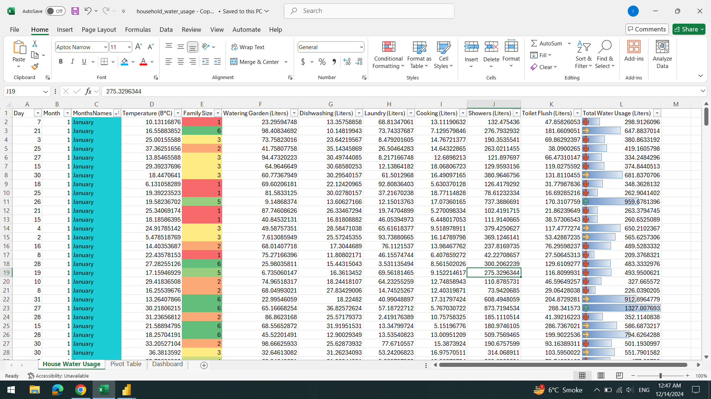
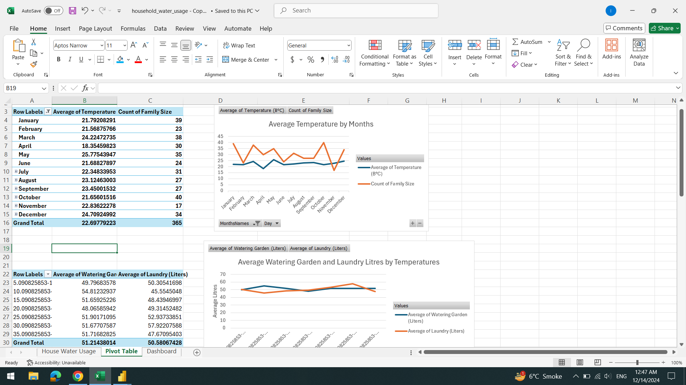
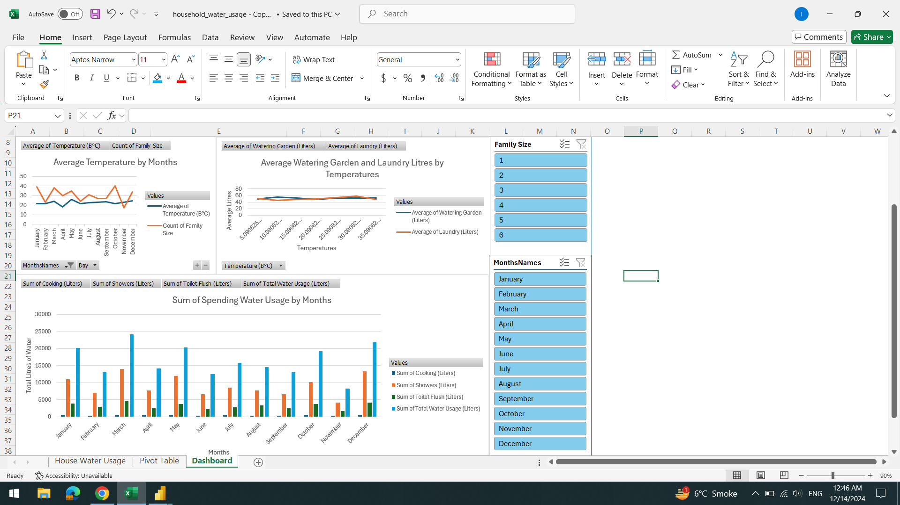

<h1>SQL & Excel <-> Data Analytics...</h1>   

<h2>Household Water Usage in 1 year by Family Size:</h2>

<h3>Data Cleaning in Excel</h3>
  

<h3>Pivot Tables of Data</h3>
  

<h3>Final Dashboard of Visualization</h3>
  